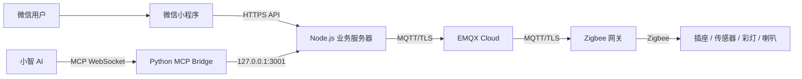

# Chengkuan Smart Home / 成宽智慧小家

一个可运行的 Zigbee 智能家居原型：使用微信小程序管理设备，Node.js 业务服务器通过 MQTT/TLS 连接 EMQX 与 Zigbee 网关，并通过 MCP 桥接小智 AI，支持自然语言查询和控制。

## 已实现功能

- 可拒绝登录的只读游客体验，以及微信登录、网关绑定和按用户隔离设备。
- 设备卡片、房间筛选、重命名和详情页。
- 计量插座开关、电压、电流、功率、电量和定时控制。
- 环境传感器温度、湿度、照度、电池和24小时趋势。
- 智能彩灯开关、亮度、色温、色相和饱和度控制。
- UIID 1400 语音喇叭文字播报、内置警示音和插座功率超限告警。
- 小智 AI MCP 查询设备状态并控制插座与彩灯。

## 仓库结构

```text
miniprogram/  原生微信小程序
server/       Node.js/Express MQTT 业务服务器
mcp-bridge/   Python/FastMCP 小智 AI 桥接
docs/         架构、部署、协议、故障复盘和写作素材
scripts/      公开发布安全检查
```

## 架构概览



GitHub 只保存代码和文档，**不会代替24小时业务服务器**。Node、MCP、cpolar 和网关仍需在一台持续运行的电脑或云主机上启动。

## 快速导航

- [系统架构](docs/architecture.md)
- [Windows 部署指南](docs/deployment-windows.md)
- [MQTT 协议实现笔记](docs/protocol-notes.md)
- [故障排查与复盘](docs/troubleshooting.md)
- [项目技术总结](docs/project-retrospective.md)
- [论文与系列文章大纲](docs/paper-and-article-outline.md)
- [安全说明](SECURITY.md)

## 最小启动顺序

1. 配置并启动 `server/`，确认 `/health` 中 MQTT 已连接。
2. 配置并启动 `mcp-bridge/`，确认 MCP WebSocket 已连接。
3. 配置 cpolar 或自己的 HTTPS 反向代理。
4. 在微信公众平台配置 request 合法域名。
5. 复制 `miniprogram/config/server.example.js` 为 `server.js`，填写公网 HTTPS API 域名后导入微信开发者工具。

## 开源与责任

本项目使用 MIT License。项目不包含厂商协议原文、设备固件和任何真实凭据。连接市电的计量插座及负载测试必须遵守用电安全要求。
