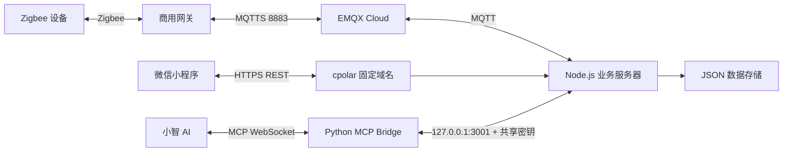

# 系统架构

## 1. 总体结构

成宽智慧小家采用“设备侧、消息层、业务层、交互层、AI 层”分离架构。

## 2. 各层职责

### 设备侧

- Zigbee 网关负责设备入网、状态上报和控制命令转发。
- 计量插座、环境传感器、彩灯、语音喇叭等子设备不直接访问互联网。
- 网关使用自身 MAC 形成 MQTT Topic 命名空间。

### 消息层

- EMQX Cloud 负责 MQTT 认证、连接维持和消息路由。
- 业务服务器订阅注册、子设备同步、状态更新、控制响应等 Topic。
- 控制方向由业务服务器向网关控制 Topic 发布 JSON 指令。

### 业务层

- 解析网关协议并归一化不同设备字段。
- 保存用户、家庭、网关、设备、状态、历史数据和定时任务。
- 完成微信登录、网关绑定、设备查询与设备控制。
- 在 `127.0.0.1:3001` 提供仅供 MCP Bridge 使用的内部 API。

### 微信交互层

- 小程序只访问业务服务器 HTTPS API，不保存 MQTT 账号密码。
- 用户通过微信登录获得业务 Token，再按账号绑定网关。
- 智家页展示设备卡片，详情页提供控制、历史趋势和定时功能。

### AI 层

- Python MCP Bridge 把自然语言工具调用转换为内部 API 请求。
- MCP Bridge 不直接连接 EMQX，减少重复协议实现和凭据扩散。
- 小智 Token 与桥接密钥只保存在 24 小时服务器的 `.env`。

## 3. 两条核心链路

状态链路：设备 -> 网关 -> EMQX -> Node.js -> 数据存储 -> 小程序或 MCP。

控制链路：小程序或小智 -> Node.js -> EMQX -> 网关 -> 设备 -> 状态/ACK 返回。

## 4. 安全边界

- 公网只暴露 Node.js 的业务 API；内部 MCP API仅监听回环地址。
- MQTT、微信 AppSecret、小智 Token、桥接密钥均不进入前端或 Git。
- 小程序正式环境只使用 HTTPS，并在微信公众平台配置 request 合法域名。
- 公开仓库只提交 `.env.example` 和示例配置。

